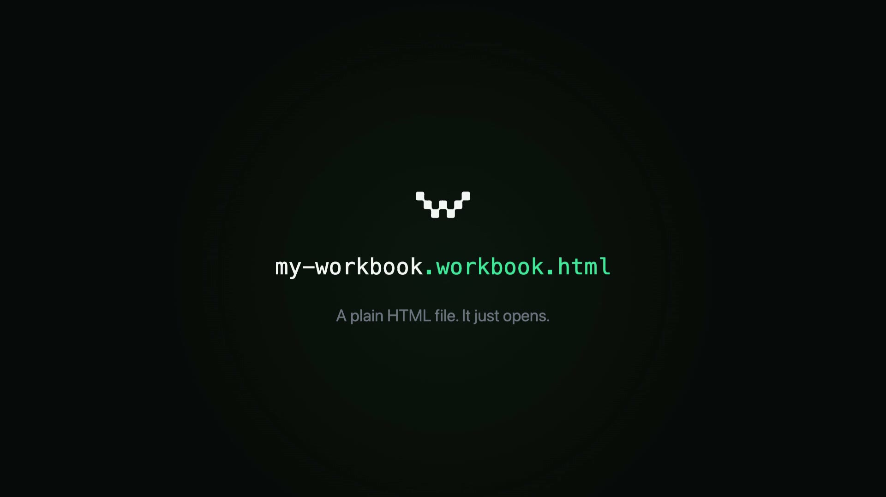

# Workbooks

<p align="center">
  <a href="assets/readme-banner.mp4">
    
  </a>
</p>

Plain HTML files that save themselves.

Open one. Edit it. Hit save. The file on disk updates.

That's it.

---

## Try it

```sh
curl -fsSL https://workbooks.sh/install | sh
```

This puts a small program (about 1 MB) in the background of your Mac.

After that, every `.workbook.html` file you double-click opens in your
browser and can save in place — like a document.

Linux and Windows are coming.

---

## What's actually in a workbook

Just an HTML file.

It opens in any browser. You don't need anything installed to view one.

If you have Workbooks installed, you can edit and save it.
If you don't, it still renders — just read-only.

That's the whole idea: one file, no servers, works everywhere, saves
when you have the runtime.

---

## Make your own

```sh
npm install -g @work.books/cli
workbook init my-thing
cd my-thing
workbook dev
```

Edit `main.js`. Save. The page reloads.

When you're done:

```sh
workbook build
```

Out comes one `dist/my-thing.workbook.html` file.

Email it. Drop it on a USB stick. Put it on a CDN. It'll open anywhere.

---

## Why this exists

People send each other Word docs, Excel files, PDFs. Each one needs a
specific app to open. The internet's universal viewer is the browser —
every device already has one.

Workbooks treat HTML as a document format. The runtime adds the one
thing browsers don't do: save the file in place.

---

## Pieces

|  |  |
|---|---|
| `packages/workbooksd`   | The background runtime. Rust, ~1 MB. Listens on localhost. |
| `packages/workbook-cli` | The author tools. `workbook init`, `dev`, `build`, `check`. |
| `packages/runtime`      | The browser-side runtime that ships inside every workbook. |
| `packages/runtime-wasm` | The Rust + WASM heavy lifters (CSV, SQL, ML). |
| `site/`                 | The workbooks.sh landing page and installer. |
| `docs/`                 | Spec, lifecycle, substrate notes. |
| `examples/`             | Workbook examples — copy any of these as a starting point. |

---

## Status

Single-binary distribution: shipping (macOS Apple Silicon + Intel).

Apple Developer ID signed. Apple notarized. SHA-256 verified.

Linux and Windows binaries: wired in CI, awaiting first tag-driven
release.

---

## Learn more

- File format → [docs/WORKBOOK_SPEC.md](docs/WORKBOOK_SPEC.md)
- Lifecycle → [docs/WORKBOOK_OPERATIONS.md](docs/WORKBOOK_OPERATIONS.md)
- Substrate → [docs/SUBSTRATE.md](docs/SUBSTRATE.md)
- Daemon source → [packages/workbooksd/](packages/workbooksd/)
- Site source → [site/](site/)

---

## License

Apache-2.0
